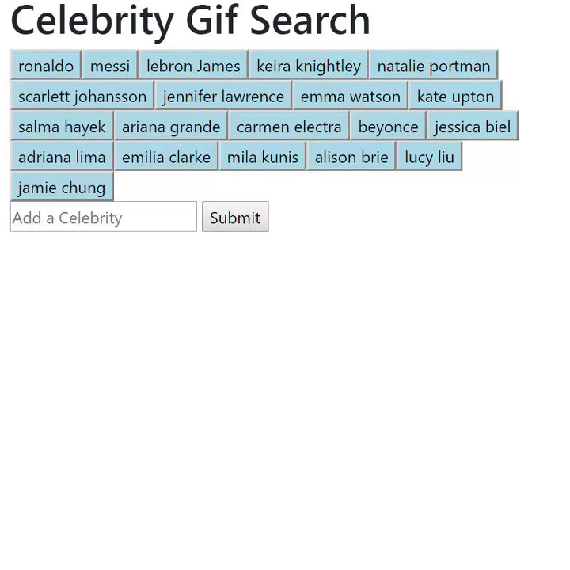

# GifTastic

## Creator
- [@moshire](https://github.com/moshire)

## Technology
* HTML
* CSS
* JQUIRY
* JavaScript
* AJAX
*  GIPHY API

## About
The purpose of this web application is diplay celebrities gifs and it also allows the user to add their favorite celebrity to see their gifs . The main components of this application include 1)a HTML containers that holds celebrities search field and displays results to the user, along with 2) the use of  GIPHY API and javascript to generate all the functionality of the application like sending request to the GIPHY and displays the response using AJAX method.

## Challenges
Using JQUIRY AJAX method to make request to the server-side Api was my challenge. After i read the GIPHY API documentation i solved that problem. 

## Instructions
1. Before you can make any part of our site work, you need to create an array of strings, each one related to a topic that interests you. Save it to a variable called `topics`.
   * We chose celebrities for our theme, but you can make a list to your own liking.

2. Your app should take the topics in this array and create buttons in your HTML.
   * Try using a loop that appends a button for each string in the array.

3. When the user clicks on a button, the page should grab 10 static, non-animated gif images from the GIPHY API and place them on the page.

4. When the user clicks one of the still GIPHY images, the gif should animate. If the user clicks the gif again, it should stop playing.

5. Under every gif, display its rating (PG, G, so on).
   * This data is provided by the GIPHY API.
   * Only once you get images displaying with button presses should you move on to the next step.

6. Add a form to your page takes the value from a user input box and adds it into your `topics` array. Then make a function call that takes each topic in the array remakes the buttons on the page.

7. Deploy your assignment to Github Pages.

8. **Rejoice**! You just made something really cool.

## How It Works
* First, click any celebrity you like.
* Next, click the gif image that page displayed to animate the gif.
* Next, click the animated gif to make it stop.
* Last, add your favorite celebrity name and see the gif.

## Gif

